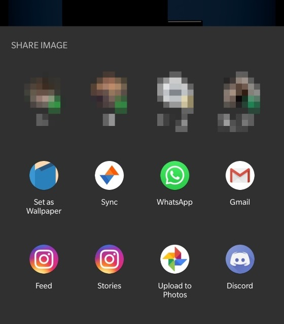

# Set as Wallpaper

I love changing my wallpaper everyday with images I find on reddit. But the process of downloading an image before setting it as the wallpaper frustrated me. 

Hence this app. 

It has no launcher icon. It will just be present in the share sheet if you are trying to share an image.

## Download links
[Github releases](https://github.com/rishabhkohli/SetAsWallpaper/releases/latest)

## Screenshots

## Credits
[Icon](https://www.flaticon.com/free-icon/wallpaper_1096245) made by [Smashicons](https://www.flaticon.com/authors/smashicons) from [www.flaticon.com]()
